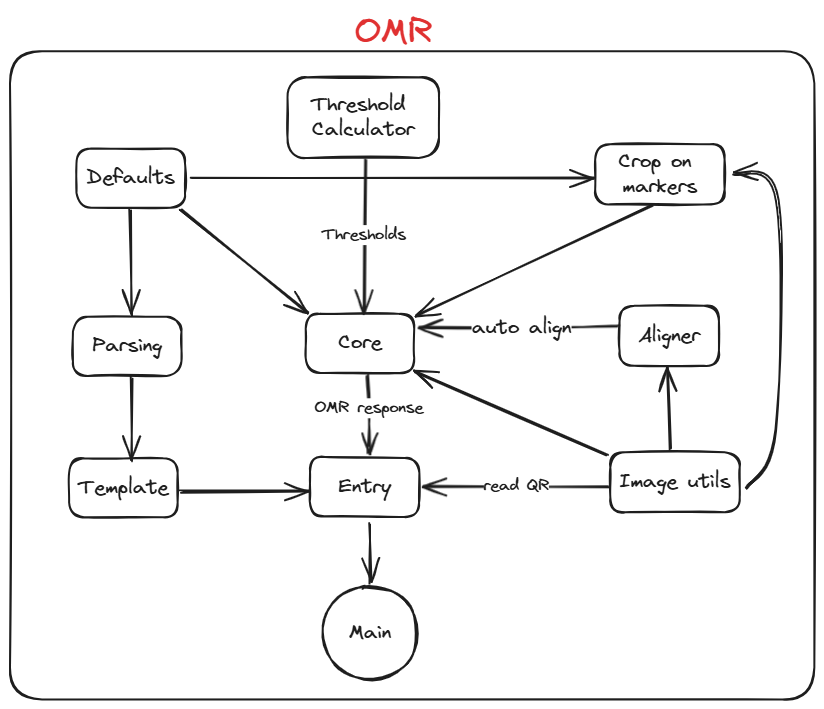

# OMR Checker
This Repo is a fork of the original [OMRChecker](https://github.com/Udayraj123/OMRChecker), Refactored to follow best practices, and modified to work as flask API.

Read OMR sheets fast and accurately using a scanner 🖨 or your phone 🤳.

## What is OMR?

OMR stands for Optical Mark Recognition, used to detect and interpret human-marked data on documents. OMR refers to the process of reading and evaluating OMR sheets, commonly used in exams, surveys, and other forms.

## 🎯 Features

A full-fledged OMR checking software that can read and evaluate OMR sheets scanned at any angle and having any color.

| Specs  |    |
| :--------------------- | :--------------------------------------------------------------------------------------------------------------------------------------------------------------------------------------------------------------- |
| 💯 **Accurate**        | Currently nearly 100% accurate on good quality document scans; and about 90% accurate on mobile images.                                                                                                          |
| 💪🏿 **Robust**          | Supports low resolution, xeroxed sheets. See [**Robustness**](https://github.com/Udayraj123/OMRChecker/wiki/Robustness) for more.                                                                                |
| ⏩ **Fast**            | Current processing speed without any optimization is 200 OMRs/minute.                                                                                                                                            |
| ✅ **Customizable**    | [Easily apply](https://github.com/Udayraj123/OMRChecker/wiki/User-Guide) to custom OMR layouts, surveys, etc.                                                                                                    |
| 📊 **Visually Rich**   | [Get insights](https://github.com/Udayraj123/OMRChecker/wiki/Rich-Visuals) to configure and debug easily.                                                                                                        |
| 🎈 **Lightweight**     | Very minimal core code size.                                                                                                                                                                                     |
| 🏫 **Large Scale**     | Tested on a large scale at [Technothlon](https://en.wikipedia.org/wiki/Technothlon).                                                                                                                             |
| 👩🏿‍💻 **Dev Friendly**    | [Pylinted](http://pylint.pycqa.org/) and [Black formatted](https://github.com/psf/black) code. Also has a [developer community](https://discord.gg/qFv2Vqf) on discord.                                          |

Note: For solving interesting challenges, developers can check out [**TODOs**](https://github.com/Udayraj123/OMRChecker/wiki/TODOs).

See the complete guide and details at [Project Wiki](https://github.com/Udayraj123/OMRChecker/wiki/).

## Fork reconstruction
Removed unused code and reconstructed the algorithm as flask api as follows

## 💡 What can OMRChecker do for me?

Once you configure the OMR layout, just throw images of the sheets at the software; and you'll get back the marked responses in an excel sheet!

Images can be taken from various angles as shown below-

	

### Code in action on images taken by scanner:

	

### Code in action on images taken by a mobile phone:

	

## Visuals

### Processing steps

See step-by-step processing of any OMR sheet:

	
	 
	*Note: This image is generated by the code itself!*

